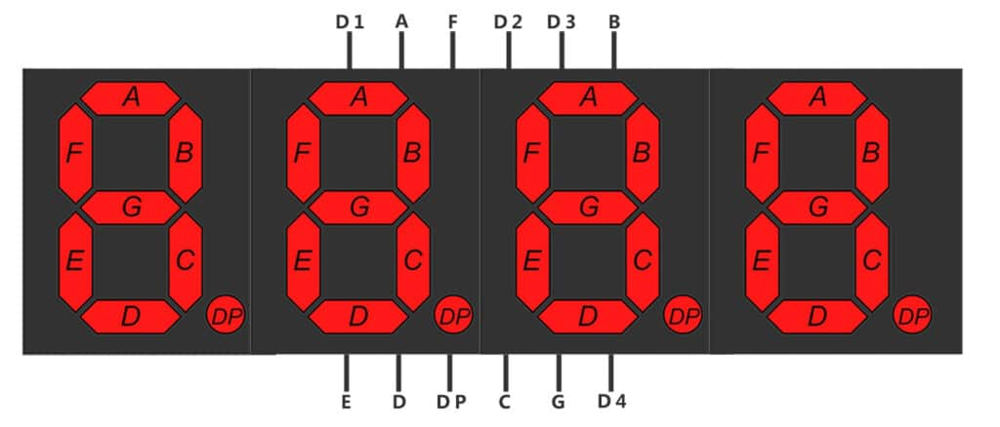

<!-- Intro  -->
<h3 align="center">
        <samp>&gt; Hey There!</samp>
</h3>

 
  <samp>
     
    「 A R D U I N O 」
     
     
  </samp>

 

 

<!-- About Section -->
 # About me
 

 
  
 ✌️ &emsp; Enjoy to do programming and sharing knowledge   
 ❤️ &emsp; Love to writing code and learning new features  

 
 
 

## Use To Code

 